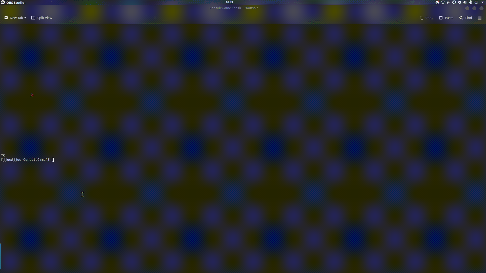

# ConsoleSandSimulation
I am making this project because I am bored and it sounded fun lol

# KEYS

Use the T key to exit the application
Use the R key to reset the world
Use W A S D to move
Use Q to remove a pixel
Use E to add a pixel (move after pressing E)
Use 1 or 2 to switch between sand and brick
